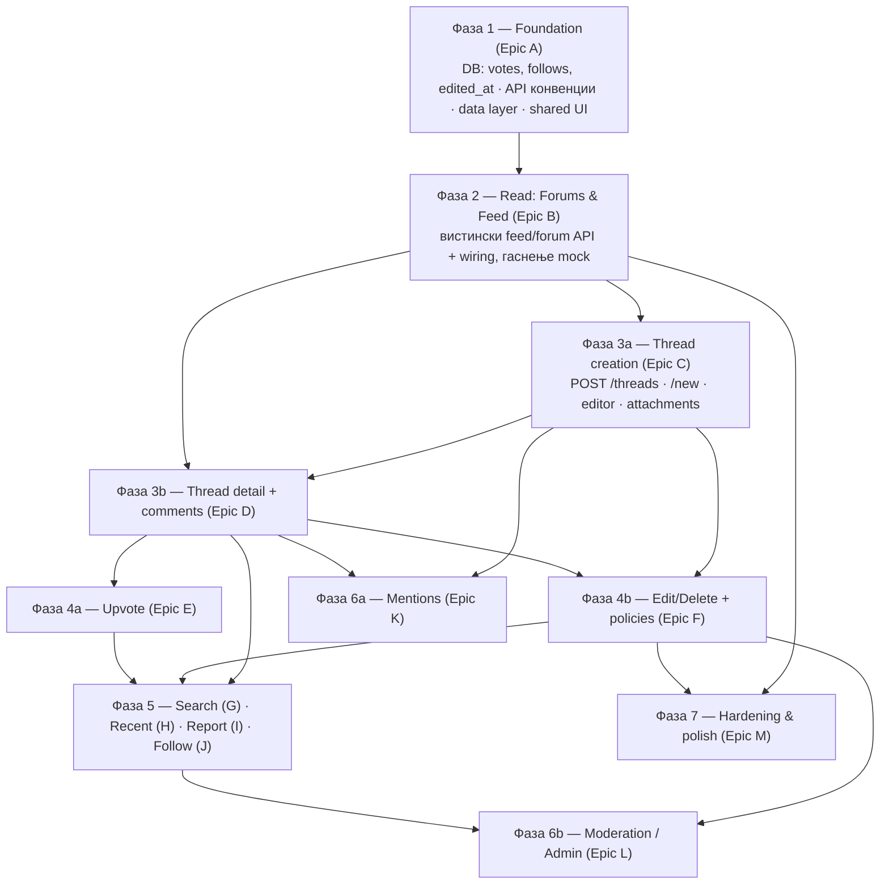

# Средношколски Глас — MVP план на задачи (Jira-ready)

> Изворен статус: види `MVP-STATUS.md`. Овој документ ја претвора преостанатата работа во **редоследно подредени епики и стории** што директно се внесуваат во Jira.
>
> Придружна датотека за увоз: **`jira-import.csv`** (Jira → Filters/Issues → Import issues from CSV).

---

## 1. Тим и улоги

| Ознака | Улога | Кој |
|--------|-------|-----|
| **BE1** | Backend (lead) | Ти |
| **BE2** | Backend | Другиот backend девелопер |
| **FS** | Fullstack — **сопственик на интеграцијата FE↔BE** | Fullstack девелопер |
| **FE1–FE4** | Frontend (јуниори) | 4 фронтенд девелопери |

**Поделба на одговорности (важно):**
- **Backend (BE1/BE2)** гради endpoints, миграции, модели, валидација, policies, бизнис логика. Враќа стабилен JSON според конвенцијата (Epic A).
- **Frontend јуниори (FE1–FE4)** градат **презентациски компоненти и страни** што примаат податоци преку props/mock — **без директни API повици**.
- **Fullstack (FS)** ги **поврзува** готовите UI компоненти со готовите endpoints (data hooks, loading/empty/error, optimistic updates, auth gate). Секоја „Wire …" стори е на FS.

> **Поделба на интеграцијата:** FS ја носи главнината на интеграцијата (feed, thread create, thread+comments, edit/delete, search, report, mentions, admin). **BE1 (ти) презема дел од wiring задачите** каде што самиот го напишал backend-от — **B7, E3, H3, J3** — за да не биде FS bottleneck. Ако сакаш уште побрзо, backend девелоперот што го напишал endpoint-от може да го врзе и тој feature.

---

## 2. Како да се чита планот

- **Епик** = голема функционална целина. **Стори** = задача што еден човек ја завршува.
- Секоја стори има: **ID**, **улога (assignee)**, **story points (SP)**, **Depends On** (што мора да е готово претходно), и **acceptance criteria** (во CSV описот).
- **Depends On** е клучно: стори може да почне штом сите нејзини зависности се завршени — **не мора да се чека цела фаза**. Фазите се само слоеви на зависност.
- Story points: Фибоначи (1, 2, 3, 5, 8). ~2 SP = пола ден, 3 = ден, 5 = 2 дена, 8 = 3–4 дена (груба ориентација).

---

## 3. Редослед на фази (зависносен слој)

**Резиме на редоследот и зошто:**
1. **Foundation прво** — без стабилни DB табели (`votes`, `follows`, `edited_at`) и договорен JSON формат, ниту backend ниту frontend можат да работат без постојано преработување.
2. **Read пред Write** — да се згасне mock и да се прикажат вистински форуми/feed, за да имаме каде да ставаме новосоздадени дискусии.
3. **Create + Detail/Comments** — јадрото. Detail страната е предуслов за upvote, edit/delete, report, follow, mentions (сите се качуваат на постот/коментарот).
4. **Upvote & Edit/Delete** — акции над веќе прикажани дискусии/коментари.
5. **Search/Recent/Report/Follow** — надградба над постоечкото јадро.
6. **Mentions & Moderation** — Report мора да постои пред Admin панелот (тој управува со Reports).
7. **Hardening** — може да тече паралелно од Фаза 4 натаму (не блокира испорака на feature-и).

---

## 4. Епици и стории

Улога = препорачан носител. `SP` = story points. `Depends On` = ID(и) што мора да се завршат прво.

### Epic A — Foundation (Фаза 1)

| ID | Задача | Улога | SP | Depends On |
|----|--------|-------|----|------------|
| A1 | `votes` табела + `Vote` модел (полиморфно votable: thread/comment; unique user+votable) | BE1 | 3 | — |
| A2 | `follows` табела + `Follow` модел (user ↔ thread; unique) | BE1 | 2 | — |
| A3 | Додади `edited_at` (nullable) на `threads` и `comments`; `deleted_by` FK (за tombstone „од корисник/модератор") | BE2 | 3 | — |
| A4 | API конвенции: единствен success/error JSON envelope, формат за валидациски грешки, pagination meta; base API Resources (Thread/Comment/Forum/User) + кратка README | BE2 | 5 | — |
| A5 | `migrate:fresh` baseline + ажурирање на seeders за новите колони/табели (примерни votes/follows) | BE1 | 2 | A1, A2, A3 |
| A6 | Frontend data layer: изгаси `USE_MOCK`, wrapper над `lib/api.js` (React Query или fetch-hooks), scaffolding hooks (`useForums` вистински) | FS | 5 | A4 |
| A7 | Shared UI: `Avatar` (imageUrl, size варијанти) | FE1 | 2 | — |
| A8 | Shared UI: `DropdownMenu` / three-dots мени (accessible, keyboard, outside-click) | FE2 | 3 | — |
| A9 | Shared UI: `Modal`/`Dialog` + `Toast` примитиви | FE3 | 3 | — |
| A10 | Shared UI: `TimeAgo` (релативно време на МК), `UpvoteButton` (презентациски, count + active), `Badge` (Featured) | FE4 | 3 | — |

### Epic B — Forums & Feed (read) (Фаза 2)

| ID | Задача | Улога | SP | Depends On |
|----|--------|-------|----|------------|
| B1 | `FeedController@index`: cross-forum feed, сортирање (Trending/Popular/New/Featured), временски прозорец, pagination | BE1 | 5 | A4 |
| B2 | `ForumController`: динамичко сортирање на sidebar по активност (последни 7 дена); школски форуми групирани по град | BE2 | 3 | A4 |
| B3 | Pagination за `ForumController@show` (дискусии во форум) | BE2 | 2 | A4 |
| B4 | Feed thread card компонента (презентациска): икона/име форум, автор+аватар, време, наслов, preview, бројачи, Featured таг | FE1 | 3 | A7, A10 |
| B5 | Forum page презентациски: `ForumBanner` + `ForumFilters` (sort/time dropdowns емитуваат state) + листа со B4 | FE2 | 3 | B4 |
| B6 | **Wire** sidebar (Thematic/School) + `/feed` на вистински API; филтрите праќаат query params; loading/empty/error | FS | 5 | A6, B1, B2, B4 |
| B7 | **Wire** `/p/[slug]` форум страна на `ForumController@show` (pagination + филтри) | BE1 | 3 | B5, B3 |

### Epic C — Thread creation (Фаза 3a)

| ID | Задача | Улога | SP | Depends On |
|----|--------|-------|----|------------|
| C1 | `POST /api/threads` (auth): валидација (forum_id задолжителен, title 3–200, body опционално); враќа resource | BE1 | 5 | A4, A5 |
| C2 | Прикачување медиум на дискусија: врзи `thread_attachments` (слика/фајл/линк/видео); прошири `MediaController` mimetypes со DOC/DOCX | BE2 | 5 | C1 |
| C3 | `/new` UI: forum picker (Topic/School групирано, приказ на опис), title, валидациски состојби, Submit (disabled додека невалидно) | FE3 | 5 | A6 |
| C4 | Rich text editor (TipTap) — чиста SSR-safe изведба: Bold/Italic/листи/линк/code/quote; излез HTML/JSON | FE4 | 5 | — |
| C5 | Editor attachments UI: upload слика, фајл (PDF/DOC), вметни линк (preview placeholder), видео embed (YouTube/TikTok) по URL | FE1 | 5 | C4 |
| C6 | **Wire** `/new` submit → `POST /api/threads` + media upload; redirect на создадената дискусија | FS | 3 | C1, C2, C3, C4 |

### Epic D — Thread detail + comments (Фаза 3b)

| ID | Задача | Улога | SP | Depends On |
|----|--------|-------|----|------------|
| D1 | `ThreadController@show`: инкрементирај views; врати цел пост + вгнездени коментари; comment sort параметар (Best/Newest/Oldest) | BE1 | 3 | A4 |
| D2 | Коментари create: `POST` (top-level + reply преку `parent_id`); валидација; враќа resource | BE2 | 5 | A4, A5 |
| D3 | Thread detail страна `/p/[slug]/[id]`: главен пост (rich content, прилози), автор блок (аватар, псевдоним+училиште), мета (време, views, бројачи) | FE2 | 5 | A7, A10 |
| D4 | Comment tree компонента: вгнездени replies со индентација + линија лево, collapse/expand, ред со акции, Best/Newest/Oldest header | FE3 | 5 | A7, A8, A10 |
| D5 | Comment composer + reply box („Add a comment" + Comment копче) | FE4 | 3 | A9 |
| D6 | **Wire** thread detail + објавување коментар/reply на API; optimistic insert; сортирање | FS | 5 | D1, D2, D3, D4, D5 |

### Epic E — Upvote (Фаза 4a)

| ID | Задача | Улога | SP | Depends On |
|----|--------|-------|----|------------|
| E1 | Votes endpoints: `POST` toggle за thread и comment; враќа нов count + `has_voted`; спречи двоен глас; само auth | BE1 | 5 | A1, A5 |
| E2 | Вклучи `upvotes_count` + `has_voted` во Thread/Comment resources | BE2 | 2 | A4, A1 |
| E3 | **Wire** `UpvoteButton` (thread + comment) со optimistic toggle + auth gate (prompt за најава) | BE1 | 3 | E1, E2, A10, D6, B6 |

### Epic F — Edit / Delete (Фаза 4b)

| ID | Задача | Улога | SP | Depends On |
|----|--------|-------|----|------------|
| F1 | Thread update/delete: `PUT` + `DELETE`, `ThreadPolicy` (само автор); постави `edited_at`; soft delete | BE1 | 5 | A3, C1 |
| F2 | Comment update/delete: `PUT` + `DELETE`, `CommentPolicy`; `edited_at`; soft delete; tombstone (корисник vs модератор) | BE2 | 5 | A3, D2 |
| F3 | Three-dots мени акции UI: Edit/Delete/Report/Share; edit-in-place форми; „(уредено)" badge; приказ на tombstone | FE1 | 5 | A8, D3, D4 |
| F4 | **Wire** edit/delete за thread & comment + policies (сокриј акции за не-автори) | FS | 3 | F1, F2, F3, D6 |

### Epic G — Search (Фаза 5)

| ID | Задача | Улога | SP | Depends On |
|----|--------|-------|----|------------|
| G1 | Search endpoint: пребарување threads (наслов/тело) + коментари; relevance/time филтри; pagination; matched snippet/highlight | BE2 | 8 | A4 |
| G2 | `/search` UI: search bar со clear, live резултати, highlight, relevance + time dropdowns, result cards | FE2 | 5 | B4 |
| G3 | **Wire** header search + `/search` live (debounced) на API; highlight | FS | 3 | G1, G2 |

### Epic H — Recent comments (Фаза 5)

| ID | Задача | Улога | SP | Depends On |
|----|--------|-------|----|------------|
| H1 | Recent comments endpoint: најнови коментари низ платформата (автор, форум, thread, време); pagination | BE1 | 3 | A4 |
| H2 | `/recent` UI: хронолошка листа (автор/форум/дискусија/текст/време/акции) | FE3 | 3 | A7, A10 |
| H3 | **Wire** `/recent` + sidebar „Најнови" линк | BE1 | 2 | H1, H2 |

### Epic I — Report (Фаза 5)

| ID | Задача | Улога | SP | Depends On |
|----|--------|-------|----|------------|
| I1 | Report create endpoint (постоечка `reports` табела): reason enum + other текст; полиморфно thread/comment; auth | BE2 | 3 | A4 |
| I2 | Report modal UI: reason radio (Spam/Навреда/Дезинформации/Возраст/Друго) + опционален детал; success toast | FE4 | 3 | A9, F3 |
| I3 | **Wire** report modal → API од three-dots мени | FS | 2 | I1, I2, F4 |

### Epic J — Follow thread (Фаза 5)

| ID | Задача | Улога | SP | Depends On |
|----|--------|-------|----|------------|
| J1 | Follow endpoints: follow/unfollow thread; `is_following` во thread resource | BE1 | 3 | A2, A5 |
| J2 | Follow копче UI (thread detail) toggle состојби | FE1 | 2 | D3 |
| J3 | **Wire** follow копче | BE1 | 1 | J1, J2, D6 |

### Epic K — Mentions (@) (Фаза 6a)

| ID | Задача | Улога | SP | Depends On |
|----|--------|-------|----|------------|
| K1 | User search endpoint за @autocomplete (по username prefix) | BE2 | 3 | A4 |
| K2 | Парсирај mentions при зачувување thread/comment → сними во `mentions`; врати податоци за приказ | BE1 | 5 | C1, D2 |
| K3 | Mention autocomplete во editor (@ trigger dropdown) + обоено рендерирање на mention | FE4 | 5 | C4, K1 |
| K4 | **Wire** mention autocomplete + перзистенција | FS | 2 | K1, K2, K3 |

### Epic L — Moderation / Admin (Фаза 6b)

| ID | Задача | Улога | SP | Depends On |
|----|--------|-------|----|------------|
| L1 | Авторизација: `users.type` (user/moderator/admin); admin gate/middleware; seed админ | BE1 | 3 | A5 |
| L2 | Reports листа + детали endpoints (admin): сортирани по време/сериозност, со контекст на содржината | BE1 | 5 | I1, L1 |
| L3 | Модераторски акции: игнорирај / отстрани содржина (mod tombstone „од модератор") / отстрани+предупреди / бан; пиши `sanctions` | BE2 | 8 | L2, F1, F2 |
| L4 | Историја на акции по корисник + `sanctions`/`appeals` endpoints (листа санкции, поднеси/реши appeal) | BE2 | 5 | L3 |
| L5 | Admin панел UI: reports queue листа + филтри (admin-gated) | FE2 | 5 | A8 |
| L6 | Admin панел UI: детален приказ на report + акциски копчиња (игнорирај/отстрани/предупреди/бан) | FE3 | 5 | L5 |
| L7 | Admin UI: историја на корисник + листа санкции + appeal преглед | FE1 | 5 | L5 |
| L8 | **Wire** admin панел на endpoints + route guard (само admin) | FS | 5 | L2, L3, L4, L5, L6, L7 |

### Epic M — Hardening & polish (Фаза 7 — тече паралелно од Фаза 4)

| ID | Задача | Улога | SP | Depends On |
|----|--------|-------|----|------------|
| M1 | Rate limiting: throttle register/login, создавање дискусија, коментар | BE1 | 3 | C1, D2 |
| M2 | Бришење акаунт (GDPR): endpoint за бришење корисник + податоци; потврди cascade | BE2 | 5 | A5 |
| M3 | Virus scan hook при media upload (ClamAV/екстерно) пред објавување | BE2 | 5 | C2 |
| M4 | Mobile-responsive app shell: hamburger + collapsible sidebar, responsive header | FE1 | 8 | B6 |
| M5 | Terms of Service, Privacy Policy, Community Guidelines страни + линкови (onboarding/footer) | FE2 | 3 | — |
| M6 | i18n полирање: `<html lang="mk">`, преведи преостанати EN стрингови, отстрани dev stub routes (`/`, `/imeNaRuta`) | FE3 | 3 | — |
| M7 | Lazy loading слики/видео + infinite scroll/pagination UI (feed/forum/search) | FE4 | 5 | B6 |
| M8 | Apple OAuth (config + активирај копче) — ако има Apple developer акаунт | FS | 3 | — |

---
 
## 5. Распределба по личност (баланс на оптоварување)

| Улога | Стории | Вкупно SP |
|-------|--------|-----------|
| **BE1** | A1, A2, A5, B1, **B7**, C1, D1, E1, **E3**, F1, H1, **H3**, J1, **J3**, K2, L1, L2, M1 | ~60 |
| **BE2** | A3, A4, B2, B3, C2, D2, E2, F2, G1, I1, K1, L3, L4, M2, M3 | ~66 |
| **FS** | A6, B6, C6, D6, F4, G3, I3, K4, L8, M8 | ~37 |
| **FE1** | A7, B4, C5, F3, J2, L7, M4 | ~30 |
| **FE2** | A8, B5, G2, L5, M5 | ~19 |
| **FE3** | A9, C3, D4, H2, L6, M6 | ~24 |
| **FE4** | A10, C4, D5, I2, K3, M7 | ~24 |

> BE2 е најнатоварен (го носи API конвенцијата, search, модерациски акции). Ако треба, префрли `M2/M3` кон друг. **BE1 сега презема дел од интеграцијата** (B7, E3, H3, J3 — сите се врзуваат на endpoints што BE1 ги напишал), што го растеретува FS.

---

## 6. Предуслови што веќе се завршени (не се задачи)

- OAuth најава (Google/Facebook) + Sanctum session cookies + onboarding.
- `GET /api/forums`, `GET /api/p/{slug}`, `GET /api/p/{slug}/comments/{thread}` (read-only) + seeders.
- `POST/DELETE /api/media` (ImageKit/S3), `GET /api/me`, `POST /api/logout`, `PUT /api/onboarding`.
- Модели/миграции веќе постојат за `reports`, `mentions`, `sanctions`, `appeals` (само треба controllers/routes/UI).
- App shell, header, sidebar, feed/forum UI (на mock — се гасне во Epic B).

---

## 7. Отворени прашања / претпоставки во планот

1. **Admin панел** е ставен во **истата Next.js апликација** (route-guarded `/admin/*`). Ако сакаш посебна админ апликација, кажи.
2. **Apple OAuth (M8)** зависи од Apple developer акаунт — оставено опционално/на крај.
3. **Virus scan (M3)** е ставен како hardening; ако немаш инфраструктура (ClamAV), може да се одложи по MVP.
4. **Search (G1)** засега е SQL `LIKE`/full-text во постоечката база; ако одиш на Postgres/Meilisearch, SP расте.

## 8. Детални описи на задачите (по ID)

> За секоја стори: **Што** (што претставува задачата), **Промени** (кои датотеки/делови се менуваат), **Како работи** (тек/логика). Патеки: backend = `backend/`, frontend = `frontend/src/`.

### Epic A — Foundation

**A1 — `votes` табела + `Vote` модел**
- **Што:** Основа за upvote — табела што памети кој корисник гласал за која дискусија/коментар.
- **Промени:** Нова миграција `create_votes_table` со `user_id`, полиморфни `votable_type` + `votable_id`, `timestamps`, и **unique(`user_id`,`votable_type`,`votable_id`)`. Нов модел `app/Models/Vote.php` со `morphTo('votable')`. Додај `morphMany(Vote::class,'votable')` во `Thread` и `Comment`, и `hasMany(Vote::class)` во `User`.
- **Како работи:** Полиморфна релација — истата табела служи и за threads и за comments. Unique индексот спречува двоен глас и е основата за toggle логиката (E1).

**A2 — `follows` табела + `Follow` модел**
- **Што:** Основа за „следи дискусија".
- **Промени:** Миграција `create_follows_table` (`user_id`, `thread_id`, `timestamps`, unique(`user_id`,`thread_id`)). Модел `Follow`. `belongsToMany`/`hasMany` релации на `User` и `Thread`.
- **Како работи:** Секој ред = еден корисник следи една дискусија. Unique спречува дупли записи; toggle-от во J1 брише/креира ред.

**A3 — `edited_at` + `deleted_by` колони**
- **Што:** Поддршка за ознака „(уредено)" и tombstone „избришано од корисник/модератор".
- **Промени:** Миграција што додава `edited_at` (nullable timestamp) и `deleted_by` (nullable FK → `users`) на `threads` и `comments`. Soft deletes веќе постои.
- **Како работи:** При edit се сетира `edited_at`; при delete се памети кој избришал во `deleted_by`, па UI знае дали да прикаже „избришано од корисник" или „од модератор".

**A4 — API конвенции + base Resources**
- **Што:** Единствен формат на JSON одговори за да frontend-от не се преправа со секој endpoint.
- **Промени:** Дефинирај success/error envelope + формат за валидациски грешки + pagination meta. Создај `app/Http/Resources/{Thread,Comment,Forum,User}Resource.php`. Приспособи ги постоечките read endpoints да враќаат преку овие Resources. Кратка секција во backend README.
- **Како работи:** Секој контролер враќа `XxxResource`, што дава конзистентни полиња (id, автор, счетачи, timestamps). Ова е договорот на кој се потпираат сите FE hooks.

**A5 — `migrate:fresh` baseline + seeders**
- **Што:** Чиста база со сите нови табели/колони и примерни податоци.
- **Промени:** Изврши `php artisan migrate:fresh --seed`. Ажурирај seeders да полнат примерни `votes`/`follows` и новите колони.
- **Како работи:** Дава заедничка почетна точка на целиот тим; сите последователни backend задачи стартуваат од оваа шема.

**A6 — Frontend data layer (гаснење на USE_MOCK)**
- **Што:** Централен слој за повикување на API-то наместо mock.
- **Промени:** Отстрани `USE_MOCK` од `lib/api/forums.js`; wrapper над `lib/api.js` (React Query или сопствени fetch-hooks); scaffolding hook `useForums` што чита од `/api/forums`.
- **Како работи:** Компонентите повикуваат hooks (loading/error/data), не raw fetch. Го задржува Sanctum cookie/CSRF текот што веќе постои во `lib/api.js`.

**A7 — Shared UI: `Avatar`**
- **Што:** Повторно употреблив аватар.
- **Промени:** `components/ui/Avatar.js` што прима `imageUrl` + `size` (sm/md/lg).
- **Како работи:** Рендерира кружна слика; при грешка при вчитување прикажува неутрален placeholder. Го користат feed картички, thread detail, коментари.

**A8 — Shared UI: `DropdownMenu` (три точки)**
- **Што:** Пристапно ⋮ мени за акции.
- **Промени:** `components/ui/DropdownMenu.js` — отвора/затвора на клик, надвор-клик и Escape; прима ставки преку props.
- **Како работи:** Основа за three-dots менито (Edit/Delete/Report/Share во F3) и за филтри/админ.

**A9 — Shared UI: `Modal` + `Toast`**
- **Што:** Модал дијалог и нотификации.
- **Промени:** `components/ui/Modal.js` (focus trap, Escape, backdrop) и `Toast` (success/error, auto-dismiss) преку provider/portal.
- **Како работи:** Report modal (I2) и потврди/грешки низ апликацијата ги користат.

**A10 — Shared UI: `TimeAgo` + `UpvoteButton` + `Badge`**
- **Што:** Три ситни презентациски примитиви.
- **Промени:** `TimeAgo` (релативно време на МК, пр. „пред 3 часа"), `UpvoteButton` (count + active state, емитува `onClick`, **без** API), `Badge` (Featured/ознаки).
- **Како работи:** Чисто визуелни; логиката за гласање се врзува подоцна (E3).

### Epic B — Forums & Feed (read)

**B1 — `FeedController@index`**
- **Што:** Cross-forum feed за `/feed`.
- **Промени:** Имплементирај го празниот `FeedController`; `GET /api/feed` со sort (Trending/Popular/New/Featured), временски прозорец и pagination; враќа `ThreadResource`.
- **Како работи:** Query над `threads` со join/сортирање; Trending = комбинација од скорешна активност; paginated одговор според A4.

**B2 — Динамичко сортирање на sidebar форуми**
- **Што:** Тематските форуми сортирани по активност (7 дена); школски групирани по град.
- **Промени:** Во `ForumController@index` додај сортирање по број постови/коментари во последните 7 дена.
- **Како работи:** Најактивните форуми одат на врв на sidebar (спец. барање 5.1).

**B3 — Pagination за `ForumController@show`**
- **Што:** Страничење на дискусии во еден форум.
- **Промени:** Замени го листањето со `paginate()`; враќа meta.
- **Како работи:** Го поддржува infinite scroll/страничење на forum page (B7/M7).

**B4 — Feed thread card (презентациска)**
- **Што:** Картичка за еден пост во feed.
- **Промени:** `components/FeedThreadCard.js` што прима props: икона/име форум, автор+`Avatar`, `TimeAgo`, наслов, preview, счетачи, `Badge` Featured.
- **Како работи:** Само props, без API — ги користи B6 и forum page.

**B5 — Forum page презентациски**
- **Што:** Визуелен склоп на форум страна.
- **Промени:** `ForumBanner` (икона/име/опис) + `ForumFilters` (sort/time dropdowns што емитуваат state) + листа од B4 картички; empty state.
- **Како работи:** Филтрите повикуваат callback; податоците ги внесува B7.

**B6 — Wire sidebar + feed**
- **Што:** Поврзување на sidebar и `/feed` со вистинскиот API.
- **Промени:** Замени hardcoded `FeedThreads.js` и mock во `ThematicForums`/`SchoolForums` со hooks од A6 (`/api/forums`, `/api/feed`); филтрите праќаат query params; loading/empty/error.
- **Како работи:** Промена на филтер → refetch со нови params. Прва вистинска end-to-end страница.

**B7 — Wire forum page**
- **Што:** Поврзување на `/p/[slug]` со `ForumController@show`.
- **Промени:** Во `app/p/[slug]/page.js` замени mock со вистински повик; pagination + филтри.
- **Како работи:** Slug од URL → API → banner + листа дискусии.

### Epic C — Thread creation

**C1 — `POST /api/threads`**
- **Што:** Endpoint за создавање дискусија.
- **Промени:** Route + метод во `ThreadController@store` (auth:sanctum); валидација: `forum_id` задолжителен и постоечки, `title` 3–200, `body` опционално; враќа `ThreadResource`.
- **Како работи:** Автентициран корисник праќа форма → се креира `Thread` врзан со форум и автор.

**C2 — Прикачување медиум на дискусија + DOC**
- **Што:** Врзување на прикачени фајлови со дискусија.
- **Промени:** При создавање thread прифати референци од `POST /api/media` и креирај `thread_attachments` (тип: слика/фајл/линк/видео). Прошири `MediaController` mimetypes со DOC/DOCX (лимит 25MB спец.).
- **Како работи:** Медиумот прво се качува (постоечки `/api/media`), па неговиот id/url се врзува со дискусијата при `store`.

**C3 — `/new` UI**
- **Што:** Форма за нова дискусија.
- **Промени:** `app/new/page.js`: forum picker (Topic/School групирано, приказ на опис под селекцијата), `title` поле, валидациски состојби, Submit (disabled додека невалидно).
- **Како работи:** Листата форуми доаѓа од hook (A6). Клиентска валидација пред испраќање.

**C4 — Rich text editor (TipTap)**
- **Што:** Чиста, SSR-safe изведба на editor-от.
- **Промени:** Преработи `components/RichTextEditor.js`: Bold/Italic/ordered+bullet листи/линк/code block/quote; излез HTML/JSON преку prop.
- **Како работи:** Динамичен import за да нема hydration грешки во Next.js; емитува serializable содржина за `body`.

**C5 — Editor attachments UI**
- **Што:** Прикачување содржина во editor-от.
- **Промени:** Upload слика, фајл (PDF/DOC), вметни линк (preview placeholder), видео embed (YouTube/TikTok) по URL.
- **Како работи:** Емитува метаподатоци за прилозите што C6 ги праќа заедно со дискусијата.

**C6 — Wire `/new` submit**
- **Што:** Поврзување на формата со backend.
- **Промени:** Submit → `POST /api/threads` + media upload тек; redirect на новата дискусија.
- **Како работи:** По успех, корисникот оди на thread detail; грешки се прикажуваат.

### Epic D — Thread detail + comments

**D1 — `ThreadController@show` надградба**
- **Што:** Читање дискусија + вгнездени коментари + views.
- **Промени:** Инкрементирај `views`; врати цел пост + дрво коментари; параметар `sort` (best/newest/oldest).
- **Како работи:** При отворање се зголемува view count; коментарите се враќаат како вгнездена структура.

**D2 — Коментари create**
- **Што:** Нов `CommentController@store`.
- **Промени:** `POST` за top-level и reply (преку `parent_id`); валидација дека `parent_id` припаѓа на истата дискусија; враќа `CommentResource`.
- **Како работи:** `parent_id` = null → top-level; инаку reply под родителот (nested).

**D3 — Thread detail страна**
- **Што:** UI за една дискусија.
- **Промени:** `app/p/[slug]/[id]/page.js`: главен пост (rich content + прилози), автор блок (`Avatar` + псевдоним + училиште), мета (`TimeAgo`, views, счетачи).
- **Како работи:** Рендерира HTML од body; прикажува прилози според тип.

**D4 — Comment tree компонента**
- **Што:** Приказ на вгнездени коментари.
- **Промени:** `components/CommentTree.js`: индентација + линија лево, collapse/expand, ред со акции по коментар, header за сортирање (Best/Newest/Oldest).
- **Како работи:** Рекурзивно рендерирање на replies; header емитува избран редослед.

**D5 — Comment composer + reply box**
- **Што:** Поле за пишување коментар/одговор.
- **Промени:** „Add a comment" поле + Comment копче; reply box што се отвора под коментар.
- **Како работи:** Емитува `content` + опционален `parent_id` преку callback.

**D6 — Wire thread detail + коментари**
- **Што:** Поврзување на детал + коментирање.
- **Промени:** Повик до `ThreadController@show` и `CommentController@store`; optimistic insert; менување sort.
- **Како работи:** Нов коментар веднаш се појавува во дрвото, се потврдува со сервер.

### Epic E — Upvote

**E1 — Vote toggle endpoints**
- **Што:** Гласање со повлекување.
- **Промени:** `POST` toggle за thread и comment; враќа нов count + `has_voted`; auth-only; користи unique од A1.
- **Како работи:** Ако веќе гласал → брише глас; инаку креира. Идемпотентно по корисник.

**E2 — Vote полиња во Resources**
- **Што:** Изложи счетач и статус.
- **Промени:** Додај `upvotes_count` + `has_voted` во `ThreadResource`/`CommentResource`.
- **Како работи:** `has_voted` се пресметува за тековниот корисник за да UI знае дали копчето е активно.

**E3 — Wire `UpvoteButton`**
- **Што:** Поврзување на копчето.
- **Промени:** Optimistic toggle на thread + comment; auth gate (prompt за најава ако е гостин).
- **Како работи:** Клик веднаш го менува бројот, се враќа при грешка; неавтентицираните добиваат покана за најава.

### Epic F — Edit / Delete

**F1 — Thread update/delete + policy**
- **Што:** Уреди/избриши сопствена дискусија.
- **Промени:** `PUT` + `DELETE`; `ThreadPolicy` (само автор); сетирај `edited_at`; soft delete.
- **Како работи:** Policy спречува туѓо уредување; delete е мек, коментарите остануваат (tombstone).

**F2 — Comment update/delete + policy**
- **Што:** Уреди/избриши сопствен коментар.
- **Промени:** `PUT` + `DELETE`; `CommentPolicy`; `edited_at`; soft delete + tombstone (корисник vs модератор преку `deleted_by`).
- **Како работи:** Избришан коментар прикажува tombstone, но replies остануваат видливи.

**F3 — Three-dots акции UI**
- **Што:** Мени Edit/Delete/Report/Share.
- **Промени:** Користи `DropdownMenu` (A8); edit-in-place форми за thread/comment; „(уредено)" badge; приказ на tombstone.
- **Како работи:** Ставки се условни (автор гледа Edit/Delete; други гледаат Report). Логика на F4.

**F4 — Wire edit/delete**
- **Што:** Поврзување на уреди/избриши.
- **Промени:** Повици до F1/F2; сокриј акции за не-автори според policy.
- **Како работи:** По успех UI се ажурира; грешки преку Toast.

### Epic G — Search

**G1 — Search endpoint**
- **Што:** Пребарување дискусии и коментари.
- **Промени:** `GET /api/search` — наслов/тело + коментари; relevance (Recent/Popular/Featured/New) и time филтри; pagination; snippet/highlight податоци.
- **Како работи:** SQL `LIKE`/full-text во постоечката база (ако се оди на Postgres/Meilisearch, обемот расте).

**G2 — `/search` UI**
- **Што:** Страна за пребарување.
- **Промени:** Search bar со clear, live резултати, highlight, relevance + time dropdowns, result cards (B4-стил).
- **Како работи:** Пишувањето (debounced) праќа query; клучните зборови означени.

**G3 — Wire header + search**
- **Што:** Поврзување на header search и `/search`.
- **Промени:** Header search рутира кон `/search`; live (debounced) повици; highlight.
- **Како работи:** `SearchBar` станува функционален (сега е само визуелен).

### Epic H — Recent comments

**H1 — Recent comments endpoint**
- **Што:** Најнови коментари низ платформата.
- **Промени:** `GET /api/recent` — автор, форум, thread ref, време; pagination.
- **Како работи:** Обратно-хронолошки список.

**H2 — `/recent` UI**
- **Што:** Страна со најнови коментари.
- **Промени:** `app/recent/page.js` — секој ред: автор/форум/дискусија/текст/време/акции.
- **Како работи:** Секој ред води до својата дискусија.

**H3 — Wire `/recent` + sidebar линк**
- **Што:** Поврзување + навигација.
- **Промени:** Врзи со H1; активирај го sidebar копчето „Најнови" (сега без `href`).
- **Како работи:** Sidebar ставката води на `/recent`.

### Epic I — Report

**I1 — Report create endpoint**
- **Што:** Пријава на содржина.
- **Промени:** `POST /api/reports` користејќи ја постоечката `reports` табела; `reason` enum + `other` текст; полиморфно thread/comment; auth.
- **Како работи:** Се снима пријава со причина; оди во админ редот (L2).

**I2 — Report modal UI**
- **Што:** Модал за пријава.
- **Промени:** Користи `Modal` (A9); radio причини (Spam/Навреда/Дезинформации/Возраст/Друго) + опционален детал; success Toast.
- **Како работи:** Валидира дека е избрана причина пред испраќање.

**I3 — Wire report modal**
- **Што:** Поврзување од ⋮ менито.
- **Промени:** Report акција → отвора modal → `POST /api/reports`.
- **Како работи:** Feedback за успех/грешка.

### Epic J — Follow thread

**J1 — Follow endpoints**
- **Што:** Следи/отследи дискусија.
- **Промени:** `POST` follow / `DELETE` unfollow (auth); `is_following` во `ThreadResource`.
- **Како работи:** Toggle врз `follows` табелата (A2).

**J2 — Follow копче UI**
- **Што:** Копче на thread detail.
- **Промени:** Состојби Follow/Following; емитува toggle.
- **Како работи:** Визуелно; логиката е во J3.

**J3 — Wire follow копче**
- **Што:** Поврзување.
- **Промени:** Toggle → follow/unfollow endpoint; состојба од сервер, враќање при грешка.
- **Како работи:** Во MVP само визуелно следење (без нотификации, спец. 6.6).

### Epic K — Mentions (@)

**K1 — User search endpoint**
- **Што:** Autocomplete извор за @.
- **Промени:** `GET /api/users/search?q=` по username prefix; ограничен/paginated резултат (username + аватар).
- **Како работи:** Го напојува dropdown-от во editor-от.

**K2 — Parse & store mentions**
- **Што:** Зачувување на споменувања.
- **Промени:** При зачувување thread/comment парсирај `@username` → мапирај во корисници → сними во `mentions`; врати податоци за приказ.
- **Како работи:** Токените се резолвираат и се памети врската за подоцнежно рендерирање.

**K3 — Mention autocomplete во editor**
- **Што:** @ dropdown + обоено рендерирање.
- **Промени:** TipTap mention екстензија со `@` trigger; избраниот mention се вметнува и се рендерира со посебна боја.
- **Како работи:** Живо пребарување преку K1 додека се пишува.

**K4 — Wire mentions**
- **Што:** Поврзување + перзистенција.
- **Промени:** Autocomplete кон API; mentions се снимаат и се рендерираат на зачуваната содржина.
- **Како работи:** Во MVP mention не праќа нотификација (спец. 6.2).

### Epic L — Moderation / Admin

**L1 — Роли + admin gate**
- **Што:** Улоги и заштита на админ рути.
- **Промени:** Користи `users.type` (user/moderator/admin); middleware/gate; seed админ.
- **Како работи:** Не-админ добива 403 на админ endpoints.

**L2 — Reports листа + детали (admin)**
- **Што:** Админ преглед на пријави.
- **Промени:** Endpoints за листа (сортирана по време/сериозност) и детал со контекст на содржината; admin-only.
- **Како работи:** Го напојува админ редот (queue).

**L3 — Модераторски акции**
- **Што:** Дејствија врз пријавена содржина.
- **Промени:** Игнорирај / отстрани (mod tombstone „од модератор") / отстрани+предупреди / бан; запис во `sanctions`.
- **Како работи:** Ажурира статус на пријавата и состојба на содржината; бан/предупреда пишува санкција.

**L4 — Историја + sanctions/appeals**
- **Што:** Историја по корисник и жалби.
- **Промени:** Листа санкции по корисник; создај appeal; admin resolve.
- **Како работи:** Ги користи постоечките `sanctions`/`appeals` табели.

**L5 — Admin reports queue UI**
- **Што:** Листа пријави.
- **Промени:** `app/admin/...` — листа со статус/сериозност/време + филтри; видлива само за админ.
- **Како работи:** Route-guarded (L8).

**L6 — Admin report detail UI**
- **Што:** Детален приказ + акции.
- **Промени:** Приказ на пријавена содржина во контекст + копчиња (игнорирај/отстрани/предупреди/бан) со потврда за деструктивни.
- **Како работи:** Ги повикува L3 акциите.

**L7 — Admin user history UI**
- **Што:** Историја + санкции + жалби.
- **Промени:** Приказ на модерациска историја и санкции по корисник; преглед на жалби.
- **Како работи:** Чита од L4.

**L8 — Wire admin панел**
- **Што:** Поврзување + guard.
- **Промени:** Сите админ прикази на endpoints; route guard (само admin).
- **Како работи:** Акциите повикуваат endpoints и освежуваат состојба; не-админ нема пристап.

### Epic M — Hardening & polish

**M1 — Rate limiting**
- **Што:** Заштита од spam.
- **Промени:** Throttle на register/login, создавање дискусија, коментар.
- **Како работи:** Враќа 429 со порака при пречекорување.

**M2 — Бришење акаунт (GDPR)**
- **Што:** Право на бришење.
- **Промени:** Endpoint за бришење корисник + податоци; потврди cascade; инвалидирај сесија.
- **Како работи:** Автентициран корисник го брише својот акаунт; податоците се бришат/анонимизираат.

**M3 — Virus scan при upload**
- **Што:** Скенирање пред објавување.
- **Промени:** Hook (ClamAV/екстерно) на media upload.
- **Како работи:** Заразени фајлови се одбиваат; ако нема инфраструктура, може да се одложи.

**M4 — Mobile-responsive app shell**
- **Што:** Мобилен layout (спец. mobile-first).
- **Промени:** Hamburger + collapsible sidebar во `AppShell`; responsive header.
- **Како работи:** Sidebar се собира на мобилен; без хоризонтален overflow.

**M5 — Legal/guidelines страни**
- **Што:** Правни страни.
- **Промени:** Terms of Service, Privacy Policy, Community Guidelines + линкови (onboarding/footer).
- **Како работи:** Реални страни наместо стилизиран текст.

**M6 — i18n полирање**
- **Што:** Целосен македонски + чистење.
- **Промени:** `<html lang="mk">`; преведи преостанати EN стрингови (auth callback, root); отстрани/redirect dev stub routes (`/`, `/imeNaRuta`).
- **Како работи:** `/` да води на `/feed`.

**M7 — Lazy load + infinite scroll**
- **Што:** Перформанси.
- **Промени:** Lazy loading слики/видео; infinite scroll/pagination UI на feed/forum/search.
- **Како работи:** Се потпира на pagination од B1/B3.

**M8 — Apple OAuth**
- **Што:** Трет provider.
- **Промени:** Конфигурирај Apple во `config/services.php` + Socialite; активирај го disabled копчето.
- **Како работи:** Зависи од Apple developer акаунт; опционално/на крај.

---

*Генерирано од `MVP-STATUS.md` + анализа на кодот. Придружна датотека: `jira-import.csv`.*
