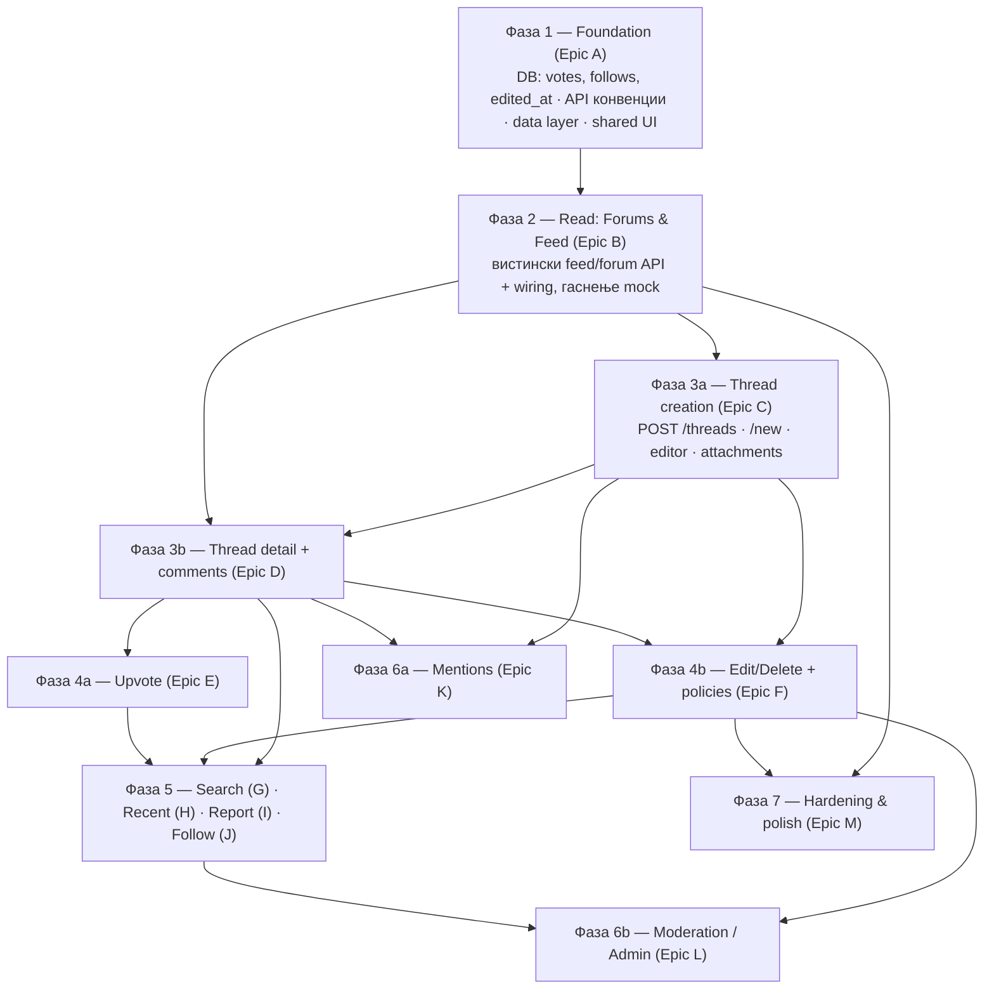

# Средношколски Глас — MVP план на задачи (Jira-ready)

> Изворен статус: види `MVP-STATUS.md`. Овој документ ја претвора преостанатата работа во **редоследно подредени епики и стории** што директно се внесуваат во Jira.
>
> Придружна датотека за увоз: **`jira-import.csv`** (Jira → Filters/Issues → Import issues from CSV).

---

## 1. Тим и улоги

| Ознака | Улога | Кој |
|--------|-------|-----|
| **BE1** | Backend (lead) | Ти |
| **BE2** | Backend | Другиот backend девелопер |
| **FS** | Fullstack — **сопственик на интеграцијата FE↔BE** | Fullstack девелопер |
| **FE1–FE4** | Frontend (јуниори) | 4 фронтенд девелопери |

**Поделба на одговорности (важно):**
- **Backend (BE1/BE2)** гради endpoints, миграции, модели, валидација, policies, бизнис логика. Враќа стабилен JSON според конвенцијата (Epic A).
- **Frontend јуниори (FE1–FE4)** градат **презентациски компоненти и страни** што примаат податоци преку props/mock — **без директни API повици**.
- **Fullstack (FS)** ги **поврзува** готовите UI компоненти со готовите endpoints (data hooks, loading/empty/error, optimistic updates, auth gate). Секоја „Wire …" стори е на FS.

> **Поделба на интеграцијата:** FS ја носи главнината на интеграцијата (feed, thread create, thread+comments, edit/delete, search, report, mentions, admin). **BE1 (ти) презема дел од wiring задачите** каде што самиот го напишал backend-от — **B7, E3, H3, J3** — за да не биде FS bottleneck. Ако сакаш уште побрзо, backend девелоперот што го напишал endpoint-от може да го врзе и тој feature.

---

## 2. Како да се чита планот

- **Епик** = голема функционална целина. **Стори** = задача што еден човек ја завршува.
- Секоја стори има: **ID**, **улога (assignee)**, **story points (SP)**, **Depends On** (што мора да е готово претходно), и **acceptance criteria** (во CSV описот).
- **Depends On** е клучно: стори може да почне штом сите нејзини зависности се завршени — **не мора да се чека цела фаза**. Фазите се само слоеви на зависност.
- Story points: Фибоначи (1, 2, 3, 5, 8). ~2 SP = пола ден, 3 = ден, 5 = 2 дена, 8 = 3–4 дена (груба ориентација).

---

## 3. Редослед на фази (зависносен слој)

**Резиме на редоследот и зошто:**
1. **Foundation прво** — без стабилни DB табели (`votes`, `follows`, `edited_at`) и договорен JSON формат, ниту backend ниту frontend можат да работат без постојано преработување.
2. **Read пред Write** — да се згасне mock и да се прикажат вистински форуми/feed, за да имаме каде да ставаме новосоздадени дискусии.
3. **Create + Detail/Comments** — јадрото. Detail страната е предуслов за upvote, edit/delete, report, follow, mentions (сите се качуваат на постот/коментарот).
4. **Upvote & Edit/Delete** — акции над веќе прикажани дискусии/коментари.
5. **Search/Recent/Report/Follow** — надградба над постоечкото јадро.
6. **Mentions & Moderation** — Report мора да постои пред Admin панелот (тој управува со Reports).
7. **Hardening** — може да тече паралелно од Фаза 4 натаму (не блокира испорака на feature-и).

---

## 4. Епици и стории

Улога = препорачан носител. `SP` = story points. `Depends On` = ID(и) што мора да се завршат прво.

### Epic A — Foundation (Фаза 1)

| ID | Задача | Улога | SP | Depends On |
|----|--------|-------|----|------------|
| A1 | `votes` табела + `Vote` модел (полиморфно votable: thread/comment; unique user+votable) | BE1 | 3 | — |
| A2 | `follows` табела + `Follow` модел (user ↔ thread; unique) | BE1 | 2 | — |
| A3 | Додади `edited_at` (nullable) на `threads` и `comments`; `deleted_by` FK (за tombstone „од корисник/модератор") | BE2 | 3 | — |
| A4 | API конвенции: единствен success/error JSON envelope, формат за валидациски грешки, pagination meta; base API Resources (Thread/Comment/Forum/User) + кратка README | BE2 | 5 | — |
| A5 | `migrate:fresh` baseline + ажурирање на seeders за новите колони/табели (примерни votes/follows) | BE1 | 2 | A1, A2, A3 |
| A6 | Frontend data layer: изгаси `USE_MOCK`, wrapper над `lib/api.js` (React Query или fetch-hooks), scaffolding hooks (`useForums` вистински) | FS | 5 | A4 |
| A7 | Shared UI: `Avatar` (imageUrl, size варијанти) | FE1 | 2 | — |
| A8 | Shared UI: `DropdownMenu` / three-dots мени (accessible, keyboard, outside-click) | FE2 | 3 | — |
| A9 | Shared UI: `Modal`/`Dialog` + `Toast` примитиви | FE3 | 3 | — |
| A10 | Shared UI: `TimeAgo` (релативно време на МК), `UpvoteButton` (презентациски, count + active), `Badge` (Featured) | FE4 | 3 | — |

### Epic B — Forums & Feed (read) (Фаза 2)

| ID | Задача | Улога | SP | Depends On |
|----|--------|-------|----|------------|
| B1 | `FeedController@index`: cross-forum feed, сортирање (Trending/Popular/New/Featured), временски прозорец, pagination | BE1 | 5 | A4 |
| B2 | `ForumController`: динамичко сортирање на sidebar по активност (последни 7 дена); школски форуми групирани по град | BE2 | 3 | A4 |
| B3 | Pagination за `ForumController@show` (дискусии во форум) | BE2 | 2 | A4 |
| B4 | Feed thread card компонента (презентациска): икона/име форум, автор+аватар, време, наслов, preview, бројачи, Featured таг | FE1 | 3 | A7, A10 |
| B5 | Forum page презентациски: `ForumBanner` + `ForumFilters` (sort/time dropdowns емитуваат state) + листа со B4 | FE2 | 3 | B4 |
| B6 | **Wire** sidebar (Thematic/School) + `/feed` на вистински API; филтрите праќаат query params; loading/empty/error | FS | 5 | A6, B1, B2, B4 |
| B7 | **Wire** `/p/[slug]` форум страна на `ForumController@show` (pagination + филтри) | BE1 | 3 | B5, B3 |

### Epic C — Thread creation (Фаза 3a)

| ID | Задача | Улога | SP | Depends On |
|----|--------|-------|----|------------|
| C1 | `POST /api/threads` (auth): валидација (forum_id задолжителен, title 3–200, body опционално); враќа resource | BE1 | 5 | A4, A5 |
| C2 | Прикачување медиум на дискусија: врзи `thread_attachments` (слика/фајл/линк/видео); прошири `MediaController` mimetypes со DOC/DOCX | BE2 | 5 | C1 |
| C3 | `/new` UI: forum picker (Topic/School групирано, приказ на опис), title, валидациски состојби, Submit (disabled додека невалидно) | FE3 | 5 | A6 |
| C4 | Rich text editor (TipTap) — чиста SSR-safe изведба: Bold/Italic/листи/линк/code/quote; излез HTML/JSON | FE4 | 5 | — |
| C5 | Editor attachments UI: upload слика, фајл (PDF/DOC), вметни линк (preview placeholder), видео embed (YouTube/TikTok) по URL | FE1 | 5 | C4 |
| C6 | **Wire** `/new` submit → `POST /api/threads` + media upload; redirect на создадената дискусија | FS | 3 | C1, C2, C3, C4 |

### Epic D — Thread detail + comments (Фаза 3b)

| ID | Задача | Улога | SP | Depends On |
|----|--------|-------|----|------------|
| D1 | `ThreadController@show`: инкрементирај views; врати цел пост + вгнездени коментари; comment sort параметар (Best/Newest/Oldest) | BE1 | 3 | A4 |
| D2 | Коментари create: `POST` (top-level + reply преку `parent_id`); валидација; враќа resource | BE2 | 5 | A4, A5 |
| D3 | Thread detail страна `/p/[slug]/[id]`: главен пост (rich content, прилози), автор блок (аватар, псевдоним+училиште), мета (време, views, бројачи) | FE2 | 5 | A7, A10 |
| D4 | Comment tree компонента: вгнездени replies со индентација + линија лево, collapse/expand, ред со акции, Best/Newest/Oldest header | FE3 | 5 | A7, A8, A10 |
| D5 | Comment composer + reply box („Add a comment" + Comment копче) | FE4 | 3 | A9 |
| D6 | **Wire** thread detail + објавување коментар/reply на API; optimistic insert; сортирање | FS | 5 | D1, D2, D3, D4, D5 |

### Epic E — Upvote (Фаза 4a)

| ID | Задача | Улога | SP | Depends On |
|----|--------|-------|----|------------|
| E1 | Votes endpoints: `POST` toggle за thread и comment; враќа нов count + `has_voted`; спречи двоен глас; само auth | BE1 | 5 | A1, A5 |
| E2 | Вклучи `upvotes_count` + `has_voted` во Thread/Comment resources | BE2 | 2 | A4, A1 |
| E3 | **Wire** `UpvoteButton` (thread + comment) со optimistic toggle + auth gate (prompt за најава) | BE1 | 3 | E1, E2, A10, D6, B6 |

### Epic F — Edit / Delete (Фаза 4b)

| ID | Задача | Улога | SP | Depends On |
|----|--------|-------|----|------------|
| F1 | Thread update/delete: `PUT` + `DELETE`, `ThreadPolicy` (само автор); постави `edited_at`; soft delete | BE1 | 5 | A3, C1 |
| F2 | Comment update/delete: `PUT` + `DELETE`, `CommentPolicy`; `edited_at`; soft delete; tombstone (корисник vs модератор) | BE2 | 5 | A3, D2 |
| F3 | Three-dots мени акции UI: Edit/Delete/Report/Share; edit-in-place форми; „(уредено)" badge; приказ на tombstone | FE1 | 5 | A8, D3, D4 |
| F4 | **Wire** edit/delete за thread & comment + policies (сокриј акции за не-автори) | FS | 3 | F1, F2, F3, D6 |

### Epic G — Search (Фаза 5)

| ID | Задача | Улога | SP | Depends On |
|----|--------|-------|----|------------|
| G1 | Search endpoint: пребарување threads (наслов/тело) + коментари; relevance/time филтри; pagination; matched snippet/highlight | BE2 | 8 | A4 |
| G2 | `/search` UI: search bar со clear, live резултати, highlight, relevance + time dropdowns, result cards | FE2 | 5 | B4 |
| G3 | **Wire** header search + `/search` live (debounced) на API; highlight | FS | 3 | G1, G2 |

### Epic H — Recent comments (Фаза 5)

| ID | Задача | Улога | SP | Depends On |
|----|--------|-------|----|------------|
| H1 | Recent comments endpoint: најнови коментари низ платформата (автор, форум, thread, време); pagination | BE1 | 3 | A4 |
| H2 | `/recent` UI: хронолошка листа (автор/форум/дискусија/текст/време/акции) | FE3 | 3 | A7, A10 |
| H3 | **Wire** `/recent` + sidebar „Најнови" линк | BE1 | 2 | H1, H2 |

### Epic I — Report (Фаза 5)

| ID | Задача | Улога | SP | Depends On |
|----|--------|-------|----|------------|
| I1 | Report create endpoint (постоечка `reports` табела): reason enum + other текст; полиморфно thread/comment; auth | BE2 | 3 | A4 |
| I2 | Report modal UI: reason radio (Spam/Навреда/Дезинформации/Возраст/Друго) + опционален детал; success toast | FE4 | 3 | A9, F3 |
| I3 | **Wire** report modal → API од three-dots мени | FS | 2 | I1, I2, F4 |

### Epic J — Follow thread (Фаза 5)

| ID | Задача | Улога | SP | Depends On |
|----|--------|-------|----|------------|
| J1 | Follow endpoints: follow/unfollow thread; `is_following` во thread resource | BE1 | 3 | A2, A5 |
| J2 | Follow копче UI (thread detail) toggle состојби | FE1 | 2 | D3 |
| J3 | **Wire** follow копче | BE1 | 1 | J1, J2, D6 |

### Epic K — Mentions (@) (Фаза 6a)

| ID | Задача | Улога | SP | Depends On |
|----|--------|-------|----|------------|
| K1 | User search endpoint за @autocomplete (по username prefix) | BE2 | 3 | A4 |
| K2 | Парсирај mentions при зачувување thread/comment → сними во `mentions`; врати податоци за приказ | BE1 | 5 | C1, D2 |
| K3 | Mention autocomplete во editor (@ trigger dropdown) + обоено рендерирање на mention | FE4 | 5 | C4, K1 |
| K4 | **Wire** mention autocomplete + перзистенција | FS | 2 | K1, K2, K3 |

### Epic L — Moderation / Admin (Фаза 6b)

| ID | Задача | Улога | SP | Depends On |
|----|--------|-------|----|------------|
| L1 | Авторизација: `users.type` (user/moderator/admin); admin gate/middleware; seed админ | BE1 | 3 | A5 |
| L2 | Reports листа + детали endpoints (admin): сортирани по време/сериозност, со контекст на содржината | BE1 | 5 | I1, L1 |
| L3 | Модераторски акции: игнорирај / отстрани содржина (mod tombstone „од модератор") / отстрани+предупреди / бан; пиши `sanctions` | BE2 | 8 | L2, F1, F2 |
| L4 | Историја на акции по корисник + `sanctions`/`appeals` endpoints (листа санкции, поднеси/реши appeal) | BE2 | 5 | L3 |
| L5 | Admin панел UI: reports queue листа + филтри (admin-gated) | FE2 | 5 | A8 |
| L6 | Admin панел UI: детален приказ на report + акциски копчиња (игнорирај/отстрани/предупреди/бан) | FE3 | 5 | L5 |
| L7 | Admin UI: историја на корисник + листа санкции + appeal преглед | FE1 | 5 | L5 |
| L8 | **Wire** admin панел на endpoints + route guard (само admin) | FS | 5 | L2, L3, L4, L5, L6, L7 |

### Epic M — Hardening & polish (Фаза 7 — тече паралелно од Фаза 4)

| ID | Задача | Улога | SP | Depends On |
|----|--------|-------|----|------------|
| M1 | Rate limiting: throttle register/login, создавање дискусија, коментар | BE1 | 3 | C1, D2 |
| M2 | Бришење акаунт (GDPR): endpoint за бришење корисник + податоци; потврди cascade | BE2 | 5 | A5 |
| M3 | Virus scan hook при media upload (ClamAV/екстерно) пред објавување | BE2 | 5 | C2 |
| M4 | Mobile-responsive app shell: hamburger + collapsible sidebar, responsive header | FE1 | 8 | B6 |
| M5 | Terms of Service, Privacy Policy, Community Guidelines страни + линкови (onboarding/footer) | FE2 | 3 | — |
| M6 | i18n полирање: `<html lang="mk">`, преведи преостанати EN стрингови, отстрани dev stub routes (`/`, `/imeNaRuta`) | FE3 | 3 | — |
| M7 | Lazy loading слики/видео + infinite scroll/pagination UI (feed/forum/search) | FE4 | 5 | B6 |
| M8 | Apple OAuth (config + активирај копче) — ако има Apple developer акаунт | FS | 3 | — |

---

## 5. Распределба по личност (баланс на оптоварување)

| Улога | Стории | Вкупно SP |
|-------|--------|-----------|
| **BE1** | A1, A2, A5, B1, **B7**, C1, D1, E1, **E3**, F1, H1, **H3**, J1, **J3**, K2, L1, L2, M1 | ~60 |
| **BE2** | A3, A4, B2, B3, C2, D2, E2, F2, G1, I1, K1, L3, L4, M2, M3 | ~66 |
| **FS** | A6, B6, C6, D6, F4, G3, I3, K4, L8, M8 | ~37 |
| **FE1** | A7, B4, C5, F3, J2, L7, M4 | ~30 |
| **FE2** | A8, B5, G2, L5, M5 | ~19 |
| **FE3** | A9, C3, D4, H2, L6, M6 | ~24 |
| **FE4** | A10, C4, D5, I2, K3, M7 | ~24 |

> BE2 е најнатоварен (го носи API конвенцијата, search, модерациски акции). Ако треба, префрли `M2/M3` кон друг. **BE1 сега презема дел од интеграцијата** (B7, E3, H3, J3 — сите се врзуваат на endpoints што BE1 ги напишал), што го растеретува FS.

---

## 6. Предуслови што веќе се завршени (не се задачи)

- OAuth најава (Google/Facebook) + Sanctum session cookies + onboarding.
- `GET /api/forums`, `GET /api/p/{slug}`, `GET /api/p/{slug}/comments/{thread}` (read-only) + seeders.
- `POST/DELETE /api/media` (ImageKit/S3), `GET /api/me`, `POST /api/logout`, `PUT /api/onboarding`.
- Модели/миграции веќе постојат за `reports`, `mentions`, `sanctions`, `appeals` (само треба controllers/routes/UI).
- App shell, header, sidebar, feed/forum UI (на mock — се гасне во Epic B).

---

## 7. Отворени прашања / претпоставки во планот

1. **Admin панел** е ставен во **истата Next.js апликација** (route-guarded `/admin/*`). Ако сакаш посебна админ апликација, кажи.
2. **Apple OAuth (M8)** зависи од Apple developer акаунт — оставено опционално/на крај.
3. **Virus scan (M3)** е ставен како hardening; ако немаш инфраструктура (ClamAV), може да се одложи по MVP.
4. **Search (G1)** засега е SQL `LIKE`/full-text во постоечката база; ако одиш на Postgres/Meilisearch, SP расте.

*Генерирано од `MVP-STATUS.md` + анализа на кодот. Придружна датотека: `jira-import.csv`.*
