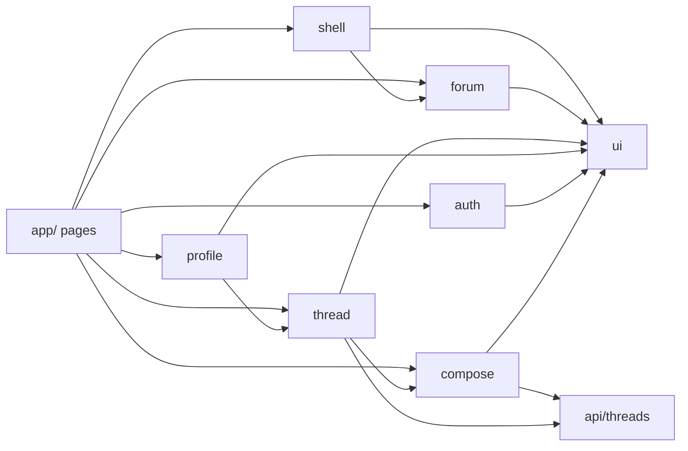

# Frontend hybrid structure reorg

## Goal

Make code findable by grouping domain UI into feature folders and shared primitives into `ui/`, then remove dead leftovers. No behavior changes; no moving inline `fetch` out of components (that stays for a later pass).

## Target layout

```
src/components/
  shell/      # app chrome
  forum/      # forum list/banner/select/sidebar sections
  thread/     # thread list, detail, comments, thread actions
  compose/    # create/edit discussion composer pieces
  profile/    # profile pages
  auth/       # login/register/onboarding
  ui/         # reusable primitives/dialogs
src/lib/
  fieldStyles.js   # moved from components/
src/api/
  threads.js       # absorbs createThread()
```



## Exact file map

**`shell/`** — `AppShell`, `Header`, `SidebarNav`, `NavItem`, `SearchBar`, `NavigationTracker`, `AuthButtons`, `CommunityBanner`, `BackButton`

**`forum/`** — `ForumBanner`, `ForumEmptyState`, `ForumIcon`, `ForumItem`, `ForumOption`, `ForumSelect`, `ForumSkeletons`, `SchoolForums`, `ThematicForums`, `CityDropdown`, `FollowForumButton`, `StartDiscussionButton`

**`thread/`** — `Threads`, `ThreadPost`, `ThreadAttachments`, `ThreadPoll`, `ThreadStats`, `ThreadStatButtons`, `ThreadActionButton`, `ThreadActionsMenu`, `ThreadMetaTags`, `FollowThreadButton`, `EditThreadDialog`, `Comment`, `CommentActions`, `CommentAuthor`, `CommentBody`, `CommentComposer`, `CommentList`, `CommentsHeader`

**`compose/`** — `NewDiscussionForm`, `NewPageFooter`, `PostTypeButtons`, `MediaAttachments`, `PollAttachment`, `LinkAttachment`, `DocumentAttachment`, `RichTextEditor`, `TitleInput`, `AnonymousToggle`

**`profile/`** — `ProfileBanner`, `ProfileTabs`, `ProfileThreadList`, `ProfileThreadItem`, `ProfileCommentList`, `ProfileFollowedForums`, `ProfileFollowedThreads`, `ProfileFollowedThreadItem`, `ProfileForumTag`

**`auth/`** — `AuthHero`, `AuthMasthead`, `SocialAuthButtons`, `OnboardingForm`, `OnboardingGuard`, `OnboardingMasthead`, `AvatarUploadCard`, `TermsCheckbox`

**`ui/`** — `Avatar`, `Checkbox`, `TextField`, `SelectField`, `SchoolSelect`, `FieldLabel`, `DialogShell`, `ConfirmDialog`, `InfoDialog`, `ReportDialog`, `PillButton`, `SubmitButton`, `ThreeDotsMenu`

## Cleanup (delete)

Only used by the legacy mock page:

- [`frontend/src/app/p/[slug]/pageOld.js`](frontend/src/app/p/[slug]/pageOld.js)
- [`frontend/src/components/ForumThreadList.js`](frontend/src/components/ForumThreadList.js)
- [`frontend/src/components/ForumFilters.js`](frontend/src/components/ForumFilters.js)

Leave `public/MOCK_JSON/` and `USE_MOCK` in [`frontend/src/api/profile.js`](frontend/src/api/profile.js) alone — profile still depends on mocks.

## API / lib normalize

1. Move `createThread` from [`frontend/src/api/createThread.js`](frontend/src/api/createThread.js) into [`frontend/src/api/threads.js`](frontend/src/api/threads.js); delete `createThread.js`.
2. Update import in `NewDiscussionForm` to `@/api/threads`.
3. Move [`frontend/src/components/fieldStyles.js`](frontend/src/components/fieldStyles.js) → `src/lib/fieldStyles.js`; update `TextField`, `SelectField`, `SchoolSelect` imports to `@/lib/fieldStyles`.

## Import updates

- Keep `@/*` aliases; no barrel `index.js` files (avoids circular exports and keeps imports explicit).
- Rewrite every `@/components/Foo` → `@/components/{folder}/Foo` across `app/` and moved components.
- Use `git mv` where possible so history is preserved.

## Out of scope (explicitly)

- Moving inline `fetch` from `Threads`, `ThreadPoll`, `AuthButtons`, etc. into `api/`/`hooks/`
- Renaming routes (`onboarding_2`, `/p/[slug]`)
- Cleaning `public/` folder names/spaces
- Splitting large files (`Threads.js`, `RichTextEditor.js`)

## Verification

1. Grep for stale paths: `@/components/[A-Z]`, `pageOld`, `ForumThreadList`, `ForumFilters`, `createThread`, `fieldStyles` under `components/`.
2. Run `npm run lint` (and a quick `npm run build` if lint is clean) from `frontend/`.
3. Smoke-check routes still resolve: `/feed`, `/p/[slug]`, thread detail, `/new`, login/register/onboarding, profile tabs.